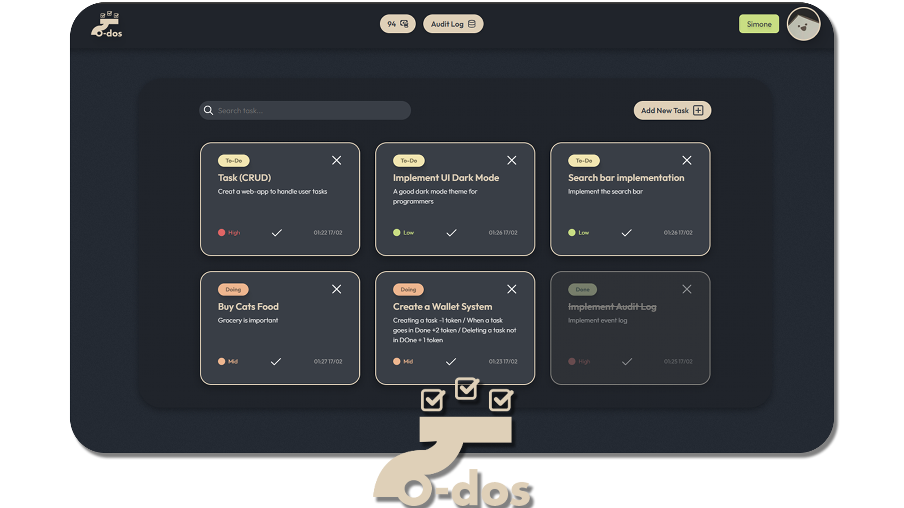

# To-Do Task Manager

A full-stack task management web application built with FastAPI and vanilla JavaScript, featuring a wallet system and audit log.

**Tech Stack:** HTML · CSS · JavaScript (ES Modules) · Python · FastAPI · SQLite · Nginx · Docker

---

## Features

- **Task CRUD** — create, edit (by clicking the card), delete and change task status
- **Wallet System** — credit system with automatic transactions
  - Create task: `-1` credit
  - Complete task (Done): `+2` credits
  - Delete incomplete task: `+1` credit (refund)
- **Audit Log** — tracks all actions with timestamps, accessible from the header
- **Search & Filter** — full-text search on title, description, priority, status and timestamp
- **Auto Sorting** — tasks sorted by status → priority → creation date
- **Persistence** — SQLite database, data survives restarts

---

## Project Structure

```
Task-Manager-Web-Application/
├── backend/
│   ├── Dockerfile
│   ├── main.py              # FastAPI + database logic
│   └── requirements.txt
├── frontend/
│   ├── Dockerfile
│   ├── nginx.conf
│   ├── css/
│   │   ├── reset.css
│   │   └── style.css
│   ├── javascript/
│   │   ├── api.js           # HTTP calls to backend
│   │   ├── app.js           # Main logic + task management
│   │   ├── config.js        # Configurations (balance, costs)
│   │   ├── headerModal.js   # Wallet and Audit Log modals
│   │   ├── taskArray.js     # Task array management + search
│   │   └── utils.js         # Utility functions
│   ├── html/
│   │   └── index.html
│   └── resources/           # Icons and images
├── docker-compose.yml
└── README.md
```

---

## Quick Start (Docker)

### Windows

> **Prerequisites:**
> - [Docker Desktop for Windows](https://www.docker.com/products/docker-desktop/)
> - [Git for Windows](https://git-scm.com)

Open **PowerShell** and run:

```powershell
git clone git@github.com:MegumiSharp/Task-Manager-Web-Application.git
cd Task-Manager-Web-Application
docker compose up --build
```

→ Open [http://localhost:8080](http://localhost:8080) in your browser.

---

### Linux / WSL

> **Prerequisites:**
> - [Docker Desktop](https://www.docker.com/products/docker-desktop/)
> - Git

Open a **bash terminal** and run:

```bash
git clone git@github.com:MegumiSharp/Task-Manager-Web-Application.git
cd Task-Manager-Web-Application/
docker compose up --build
```

→ Open [http://localhost:8080](http://localhost:8080) in your browser. ✅

---

**Stop the app**
```bash
docker compose down
```
Your data is saved and will be there on the next start.

**Reset everything (deletes the database)**
```bash
docker compose down -v --rmi all
```
> ⚠️ This will delete all data stored in volumes (database, uploads, etc.) **of the project**. This action is irreversible.
---

## Local Development (Without Docker)

> **Prerequisites:** VS Code with [Live Server](https://marketplace.visualstudio.com/items?itemName=ritwickdey.LiveServer) extension, Python 3.10+

**1. Clone and open**
```bash
git clone git@github.com:MegumiSharp/Task-Manager-Web-Application.git
cd Task-Manager-Web-Application/
code .
```

**2. Start the backend**
```bash
cd backend
pip install -r requirements.txt
uvicorn main:app --reload --port 8000
```

**3. Start the frontend**

Click the Live Server button in VS Code and navigate to `http://localhost:5500/frontend/html/`

> Note: Live Server automatically reloads the page on any file change — this is expected behavior and does not happen in Docker.

---

## How to Use

1. **Create a task** — click "Add New Task", fill in the title (required), description, priority and status
2. **Edit a task** — click on any card to open the edit modal
3. **Complete a task** — click the checkmark ✓ on the card
4. **Delete a task** — click the red ✕ on the card
5. **View wallet** — click the credits button in the header (shows full transaction history)
6. **View audit log** — click "Audit Log" in the header
7. **Search tasks** — use the search bar (minimum 2 characters)

---

## Configuration

Edit `frontend/javascript/config.js` to change the starting balance, username or transaction costs:

```javascript
export const STARTER_BALANCE = 100;  // Initial balance

const username = "TaskMaster";

export const TRANSACTION_AMOUNT = {
    CREDIT: 2,    // Credits earned for completing a task
    DEBIT: 1,     // Cost to create a task
    REFUND: 1     // Refund for deleting an incomplete task
};
```

---

## Troubleshooting

**Port 8080 already in use?**  
Change the port in `docker-compose.yml`:
```yaml
ports:
  - "9090:80"   # Access at http://localhost:9090 instead
```

**App not loading after a code change?**  
Always rebuild after modifying source files:
```bash
docker compose down
docker compose up --build
```

---

## Development Notes

I used vanilla JavaScript to avoid framework complexity and to focus on better understanding JavaScript fundamentals. I also used Figma for UI mockups, which helped a lot with CSS planning.

Having a time limit pushed me to give my best. Even under pressure I took the time to properly understand concepts before implementing them. I essentially re-learned JavaScript from scratch during this project — urgency and curiosity drove me to keep adding features while planning to clean things up later. That "later" accumulated. CSS suffered the most from this, but I had to leave it as-is due to time constraints.

Regardless of the outcome, I'll continue improving this project — it taught me a lot in a short time.

**What I would have liked to add:**
- More test coverage
- Better external documentation
- Cleaner and more consistent naming conventions
- Standard-compliant commit schema
- Better upfront architecture planning

---

**Developed for:** G-nous srl — Technical Test for Internship  
**Author:** Gaetano Simone Enselmi  
**Period:** 11/02/2025 → 17/02/2025